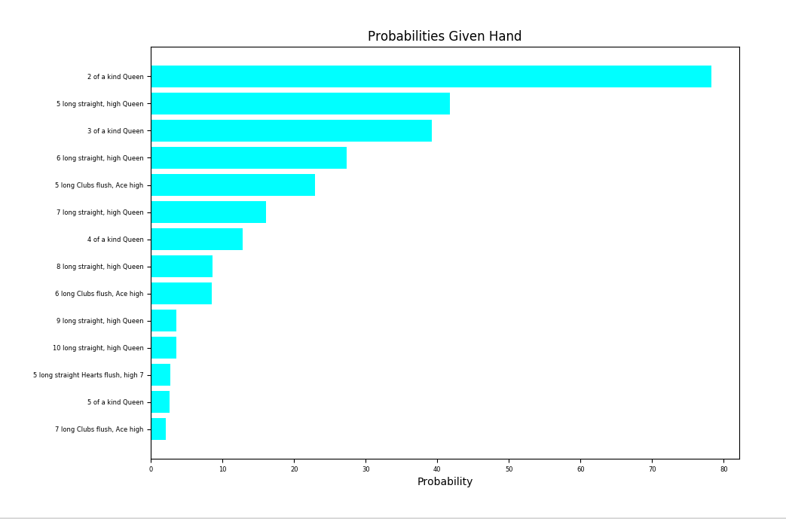

# BS Poker Probabilities Calculator
## BS Poker Rules
BS poker is a card game with rules as follows. A set number of cards is dealt to each player. The players go around a circle calling out higher and higher poker hands, trying to guess which poker hands can be adequately formed using the cards pooled together by all the players. Then when one player calls BS, all cards are revealed. If the last claim was true, the player who called BS loses. If it was false, the player who was convicted of BS loses.

Special BS poker rules: 2's are wild cards which can represent any suit and any number/royal. Poker hands longer than 5 cards are possible.

## Calculator
This calculator is capable of figuring out an optimal play or ranking the chances of each BS poker hand. Note that BS poker differs from regular poker in that 2's are wild cards and that poker hands may have more than 5 cards.

## Usage
Find optimal play:
- Syntax: `find_best_play(num_decks,num_cards,my_hand,trials=10000)`
- Example finding best play with three known cards (three jacks from one deck) and a total of 15 cards from one deck:
```
import bs_calc as bs

bs.optimal.find_best_play(1,15,[("Spades","Jack",0),("Clubs","Jack",0),("Hearts","Jack",0)])`
```
Find chances of there existing any of flush/straight/kind/straightflush:
- Syntax: `rank_general_chances(num_trials=10000)`
- Example ranking with 100000 trials:
```
import bs_calc as bs

bs.optimal.rank_chances(100000)
```

Find chances of there existing the flush/straight/kind/straightflush which has highest chance given a random hand:
- Syntax: `rank_specific_all(num_trials=100)`
- Example ranking with 200 different hands:
```
import bs_calc as bs

bs.optimal.rank_specific_all(200)
```


## Find Best Play Example:
Given a hand of a spades jack, a clubs queen, and a hearts 3, my PC generated psuedorandom combitions of 12 more cards from 2 decks and counted the number of occurances of various combitions to figure out the best BS poker calls.




## General Results:
The program generated psuedorandom hands of 15 cards from 1 deck and counted the number of occurrances of the following from 100000 trials. Note: this is the chance of there existing any kind/flush/straight/straightflush rather than the chance of a specific one.   Results are as follows.


## Specific Results:
The program generated psuedorandom hands of 15 cards with 3 known (5000 trials) from one deck.  For each hand and each category (kind/flush/straightflush/straight), the program found the BS call with the highest chance based on the known cards, and then counted the number of occurrances of that specific call. Results are as follows.


